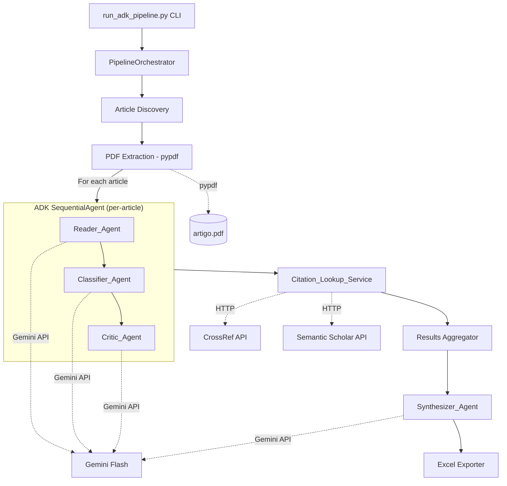

# Design Document: ADK Article Classification Pipeline

## Overview

This design replaces the existing single-call Gemini classification pipeline (`scripts/src/gemini_classifier.py`) with a Google Agent Development Kit (ADK) multi-agent architecture. The current system sends one monolithic prompt per article, combining text extraction, metadata classification, qualitative rubric evaluation, and summary generation into a single LLM call. This produces inconsistent results and makes it difficult to isolate errors or retry specific steps.

The new architecture decomposes the task into four specialized ADK agents:
- **Reader_Agent**: Extracts PDF text and produces a structured super-summary
- **Classifier_Agent**: Extracts objective metadata with Pydantic-validated output
- **Critic_Agent**: Performs qualitative rubric evaluation with justifications
- **Synthesizer_Agent**: Analyzes cross-article thematic relationships

Each agent has a focused prompt, reducing hallucination risk and enabling targeted retries. The ADK framework provides built-in orchestration via `SequentialAgent`, structured output validation, and tool management.

### Key Design Decisions

1. **Sequential per-article processing**: Reader → Classifier → Critic per article, then one Synthesizer pass. This mirrors the logical dependency chain and allows partial results on failure.
2. **ADK SequentialAgent scoped to per-article flow**: The ADK `SequentialAgent` handles ONLY the Reader → Classifier → Critic agent sequence. The `PipelineOrchestrator` controls the full pipeline lifecycle (discovery, PDF extraction, per-article agent sequence invocation, citation lookup, aggregation, synthesis, Excel export). The SequentialAgent is nested inside the orchestrator's per-article loop.
3. **Pydantic models for inter-agent contracts**: Each agent's input AND output is defined as a Pydantic model, making inter-agent data contracts explicit and validated at both ends.
4. **Citation lookup as a standalone service (not an agent)**: Citation fetching is deterministic I/O without LLM reasoning, so it's implemented as a tool/service rather than an ADK agent.
5. **Graceful degradation with clear failure boundaries**: PDF extraction failure (pypdf) allows the article to proceed with metadata-only context to Classifier/Critic. Reader Agent LLM failure (after all retries) records a partial error and SKIPS Classifier/Critic for that article entirely.
6. **Processing status tracking**: Each article carries an explicit `ProcessingStatus` enum recording where (if anywhere) the pipeline failed, enabling transparent reporting in the Excel export.

## Architecture



> **Scope clarification**: The `PipelineOrchestrator` owns the full pipeline lifecycle. The ADK `SequentialAgent` is instantiated per-article inside the orchestrator's processing loop and handles ONLY the Reader → Classifier → Critic agent chain. PDF extraction (pypdf) happens BEFORE the SequentialAgent is invoked — it is orchestrator-level logic, not agent logic.

### Module Structure

```
run_adk_pipeline.py              # CLI entrypoint
src/
├── __init__.py
├── config.py                    # Constants, paths, syllabus data
├── models/
│   ├── __init__.py
│   ├── inputs.py                # Pydantic INPUT models for each agent
│   ├── super_summary.py         # SuperSummary Pydantic model
│   ├── classification.py        # ClassificationOutput Pydantic model
│   ├── critic_output.py         # CriticOutput Pydantic model
│   ├── synthesis.py             # SynthesisOutput Pydantic model
│   └── article_result.py       # ArticleResult + ProcessingStatus
├── agents/
│   ├── __init__.py
│   ├── reader_agent.py          # Reader_Agent definition
│   ├── classifier_agent.py      # Classifier_Agent definition
│   ├── critic_agent.py          # Critic_Agent definition
│   └── synthesizer_agent.py     # Synthesizer_Agent definition
├── services/
│   ├── __init__.py
│   ├── pdf_extractor.py         # PDF text extraction (pypdf)
│   ├── citation_lookup.py       # CrossRef/Semantic Scholar integration
│   └── cache.py                 # JSON file cache with TTL
├── orchestrator.py              # PipelineOrchestrator: per-article + synthesis
├── discovery.py                 # Article folder scanning and filtering
├── excel_exporter.py            # Styled Excel export with openpyxl
└── ifrd.py                      # IFRD calculation logic
```

## Components and Interfaces

### 1. Article Discovery (`discovery.py`)

Responsible for scanning `artigos/` directory, filtering valid article folders, and parsing `info.md` metadata.

```python
@dataclass
class ArticleMetadata:
    folder_path: Path
    title: str          # From H1 heading in info.md
    student: str        # From "Aluno" field
    group: str          # From "Grupo" field
    link: str           # From "Link original" field
    pdf_path: Path      # Path to artigo.pdf

def discover_articles(base_dir: Path, max_depth: int = 3) -> list[ArticleMetadata]:
    """Recursively scan for valid article folders (containing info.md + artigo.pdf)."""
    ...

def parse_info_md(info_path: Path) -> dict[str, str]:
    """Extract metadata fields from info.md, defaulting missing fields to empty string."""
    ...
```

### 2. PDF Extractor Service (`services/pdf_extractor.py`)

Extracts and normalizes text from PDF files. Reuses the existing `pypdf` approach.

```python
@dataclass
class ExtractionResult:
    text: str
    success: bool
    error_message: str | None = None

def extract_pdf_text(pdf_path: Path, max_chars: int = 80_000) -> ExtractionResult:
    """Extract text from PDF, normalize whitespace, truncate to max_chars."""
    ...
```

### 3. Reader Agent (`agents/reader_agent.py`)

An ADK `LlmAgent` that takes extracted PDF text and produces a structured `SuperSummary`.

```python
from google.adk.agents import Agent

reader_agent = Agent(
    model="gemini-2.0-flash",
    name="reader_agent",
    description="Extracts structured super-summary from PDF text",
    instruction="...",  # Focused prompt for summarization
    output_schema=SuperSummary,
)
```

**Input**: `ReaderInput` Pydantic model  
**Output**: `SuperSummary` Pydantic model

### 4. Classifier Agent (`agents/classifier_agent.py`)

An ADK `LlmAgent` that takes the `SuperSummary` + metadata and produces structured classification.

```python
classifier_agent = Agent(
    model="gemini-2.0-flash",
    name="classifier_agent",
    description="Classifies article metadata from super-summary",
    instruction="...",  # Includes TOPICOS_EMENTA and UNIDADES context
    output_schema=ClassificationOutput,
)
```

**Input**: `ClassifierInput` Pydantic model  
**Output**: `ClassificationOutput` Pydantic model

### 5. Critic Agent (`agents/critic_agent.py`)

An ADK `LlmAgent` that performs qualitative rubric evaluation.

```python
critic_agent = Agent(
    model="gemini-2.0-flash",
    name="critic_agent",
    description="Evaluates article quality with rubric scores and justifications",
    instruction="...",  # Rubric criteria with scoring guidelines
    output_schema=CriticOutput,
)
```

**Input**: `CriticInput` Pydantic model  
**Output**: `CriticOutput` Pydantic model

### 6. Synthesizer Agent (`agents/synthesizer_agent.py`)

An ADK `LlmAgent` that analyzes relationships across all processed articles.

```python
synthesizer_agent = Agent(
    model="gemini-2.0-flash",
    name="synthesizer_agent",
    description="Analyzes thematic relationships across all classified articles",
    instruction="...",
    output_schema=SynthesisOutput,
)
```

**Input**: `SynthesizerInput` Pydantic model  
**Output**: `SynthesisOutput` Pydantic model

### 7. Citation Lookup Service (`services/citation_lookup.py`)

HTTP-based service querying CrossRef and Semantic Scholar APIs with caching.

```python
@dataclass
class CitationResult:
    count: int | None    # None means "N/A"
    source: str          # "crossref", "semantic_scholar", or "cache"

class CitationLookupService:
    def __init__(self, cache_path: Path, cache_ttl_days: int = 7):
        ...

    def get_citation_count(self, title: str) -> CitationResult:
        """Query APIs with fallback chain: cache → CrossRef → Semantic Scholar → N/A."""
        ...
```

### 8. Pipeline Orchestrator (`orchestrator.py`)

Controls the full pipeline lifecycle. The ADK `SequentialAgent` is instantiated per-article and handles ONLY the Reader → Classifier → Critic chain. Everything else (discovery, PDF extraction, citation lookup, aggregation, synthesis, Excel export) is orchestrator-level logic.

```python
from google.adk.agents import SequentialAgent

class PipelineOrchestrator:
    """
    Full pipeline controller. Responsibilities:
    - Article discovery and PDF extraction (pre-agent)
    - Per-article SequentialAgent invocation (Reader → Classifier → Critic)
    - Citation lookup (post-agent, per article)
    - Results aggregation
    - Synthesizer Agent invocation (once, after all articles)
    - Excel export
    """

    def __init__(self, delay_seconds: float = 4.0, max_retries: int = 3):
        self._article_sequence = SequentialAgent(
            name="article_classification_sequence",
            sub_agents=[reader_agent, classifier_agent, critic_agent],
        )
        ...

    async def process_article(self, metadata: ArticleMetadata) -> ArticleResult:
        """
        1. Extract PDF text (pypdf) — orchestrator logic, NOT inside SequentialAgent
        2. If PDF extraction fails: proceed with metadata-only context to SequentialAgent
        3. Invoke SequentialAgent (Reader → Classifier → Critic)
        4. If Reader LLM fails after retries: record error, SKIP Classifier/Critic
        5. Return ArticleResult with appropriate ProcessingStatus
        """
        ...

    async def run_synthesis(self, results: list[ArticleResult]) -> SynthesisOutput | None:
        """Run Synthesizer on all results. Returns None on failure."""
        ...

    async def run(
        self,
        articles: list[ArticleMetadata],
        progress_callback: Callable[[int, int, str], None] | None = None,
    ) -> PipelineResult:
        """Execute full pipeline: discovery → PDF extraction → per-article agents → citations → synthesis → export."""
        ...
```

### 9. IFRD Calculator (`ifrd.py`)

Pure function for computing the IFRD composite index.

```python
def calculate_ifrd(scores: dict[str, int]) -> float:
    """
    IFRD = 0.25×Qualidade + 0.20×Alinhamento + 0.20×Aprendizagem 
         + 0.15×Replicabilidade + 0.10×Aplicabilidade + 0.10×Adequação
    Rounded to 2 decimal places.
    """
    ...

def classify_ifrd(ifrd: float) -> tuple[str, str]:
    """Returns (classification_label, color) based on IFRD thresholds."""
    ...
```

### 10. Excel Exporter (`excel_exporter.py`)

Exports classification results + synthesis to a styled `.xlsx` file. Includes a `ProcessingStatus` column so users can see at a glance which articles had issues.

```python
class ExcelExporter:
    @staticmethod
    def export(
        results: list[ArticleResult],
        synthesis: SynthesisOutput | None,
        output_path: Path,
    ) -> None:
        """
        Export to Excel with two worksheets: main data + thematic synthesis.
        
        The main worksheet includes a 'Status' column populated from
        ArticleResult.processing_status (ProcessingStatus enum).
        Rows with non-SUCCESS status have their Status cell highlighted
        in orange for quick visual identification.
        """
        ...
```

## Data Models

### Agent Input Models (`models/inputs.py`)

Explicit Pydantic input models define the contract for what each agent receives. These are used to construct the agent prompts and validate inter-agent data flow.

```python
from pydantic import BaseModel, Field
from typing import List, Optional

class ArticleMetadataDTO(BaseModel):
    """Serializable version of ArticleMetadata for agent input."""
    folder_path: str
    title: str
    student: str
    group: str
    link: str

class ReaderInput(BaseModel):
    """Input to Reader_Agent — extracted PDF text + metadata."""
    metadata: ArticleMetadataDTO
    extracted_text: str = Field(..., description="Raw PDF text (may be empty if extraction failed)")
    pdf_extraction_failed: bool = Field(default=False, description="True if pypdf extraction failed")

class ClassifierInput(BaseModel):
    """Input to Classifier_Agent — super-summary + metadata."""
    metadata: ArticleMetadataDTO
    super_summary: Optional["SuperSummary"] = Field(
        None, description="SuperSummary from Reader. None if Reader LLM failed (metadata-only context)."
    )

class CriticInput(BaseModel):
    """Input to Critic_Agent — super-summary + metadata + classification."""
    metadata: ArticleMetadataDTO
    super_summary: Optional["SuperSummary"] = Field(None)
    classification: "ClassificationOutput"

class SynthesizerInput(BaseModel):
    """Input to Synthesizer_Agent — all article results."""
    articles: List["ArticleResultSummary"] = Field(
        ..., description="Complete list of processed article results for cross-article analysis"
    )

class ArticleResultSummary(BaseModel):
    """Condensed article result for synthesis input."""
    folder_name: str
    title: str
    theme: Optional[str] = None
    syllabus_units: List[str] = Field(default_factory=list)
    syllabus_topics: List[str] = Field(default_factory=list)
    super_summary: Optional["SuperSummary"] = None
    rubric_scores: Optional[dict[str, int]] = None
```

### SuperSummary

```python
from pydantic import BaseModel, Field
from typing import List

class SuperSummary(BaseModel):
    core_research_question: str = Field(..., description="The central research question addressed")
    methodology_description: str = Field(..., description="Description of the research methodology")
    key_findings: List[str] = Field(..., min_length=1, max_length=10, description="Key findings (1-10)")
    statistical_techniques: List[str] = Field(default_factory=list, description="Statistical techniques used")
```

### ClassificationOutput

```python
from pydantic import BaseModel, Field, field_validator
from typing import List, Literal, Optional
from datetime import datetime

class ClassificationOutput(BaseModel):
    theme: str
    publication_year: Optional[int] = Field(
        None, description="Publication year (1900 to current year), or None when year cannot be determined"
    )
    publisher_entity: str
    venue_type: Literal["Revista (Journal)", "Conferência (Conference)", "Repositório (arXiv/Preprint)", "Outro"]
    study_type: Literal["Experimento Controlado", "Quase-experimento", "Estudo de Caso", "Survey", "Revisão Sistemática", "Proposta Conceitual", "Outro"]
    research_nature: Literal["Prática (Empírica)", "Teórica", "Híbrida"]
    data_nature: Literal["Quantitativa", "Qualitativa", "Mista"]
    sample_size: str
    statistical_methods: List[str] = Field(default_factory=list)
    software_metrics: List[str] = Field(default_factory=list)
    syllabus_units: List[str] = Field(..., min_length=1)
    syllabus_topics: List[str] = Field(..., min_length=1)

    @field_validator("publication_year")
    @classmethod
    def validate_publication_year(cls, v):
        """Accept range 1900 to current year, or None. Prevents hallucination of fake years."""
        if v is None:
            return v
        current_year = datetime.now().year
        if v < 1900 or v > current_year:
            raise ValueError(
                f"publication_year must be between 1900 and {current_year}, or None. Got: {v}"
            )
        return v

    @field_validator("syllabus_units")
    @classmethod
    def validate_units(cls, v):
        valid = {"Unidade 1", "Unidade 2", "Unidade 3"}
        for unit in v:
            if unit not in valid:
                raise ValueError(f"Invalid unit: {unit}")
        return v
```

### CriticOutput

```python
from pydantic import BaseModel, Field, field_validator
from typing import List, Literal

class RubricScore(BaseModel):
    score: int = Field(..., ge=1, le=5)
    justification: str = Field(..., min_length=20, max_length=500)

class CriticOutput(BaseModel):
    qualidade_academica: RubricScore
    replicabilidade: RubricScore
    aplicabilidade_pratica: RubricScore
    contribuicao_teorica: RubricScore
    adequacao_aluno: RubricScore
    contribuicao_aprendizagem: RubricScore
    alinhamento_plano: RubricScore
    
    # Reproducibility assessment
    data_availability: Literal["Totalmente Disponível", "Parcialmente Disponível", "Não Disponível"]
    replication_links: List[str] = Field(default_factory=list)
    shared_artifacts: List[Literal["Código Fonte", "Dataset", "Scripts R/Python", "Questionários", "Nenhum"]]
    
    # Summary
    resumo_pt: str = Field(..., description="Summary in PT-BR, max 150 words")
    main_findings: List[str] = Field(..., min_length=3, max_length=3)
    principal_limitation: str = Field(..., max_length=250)

    @field_validator("shared_artifacts")
    @classmethod
    def validate_shared_artifacts_mutual_exclusion(cls, v):
        """If 'Nenhum' is present, it must be the only item. Prevents contradictions like ['Código Fonte', 'Nenhum']."""
        if "Nenhum" in v and len(v) > 1:
            raise ValueError(
                "shared_artifacts: 'Nenhum' must be the sole item when present. "
                f"Got contradictory list: {v}"
            )
        return v

    @field_validator("resumo_pt")
    @classmethod
    def validate_word_count(cls, v):
        if len(v.split()) > 150:
            raise ValueError("Summary exceeds 150 words")
        return v
```

### SynthesisOutput

```python
from pydantic import BaseModel, Field
from typing import List

class ThematicRelationship(BaseModel):
    relationship_type: Literal["overlap", "continuity", "complementation"]
    description: str
    article_references: List[str]  # Folder names

class ThematicCluster(BaseModel):
    label: str = Field(..., max_length=60)
    article_references: List[str]

class IFRDDiscussion(BaseModel):
    formula_rationale: str
    limitations: List[str] = Field(..., min_length=1)
    viability_conclusion: str

class SynthesisOutput(BaseModel):
    relationships: List[ThematicRelationship]
    clusters: List[ThematicCluster]
    ifrd_discussion: IFRDDiscussion
    no_overlap_statement: str | None = None
    no_continuity_statement: str | None = None
    no_complementation_statement: str | None = None
```

### ArticleResult (Internal)

```python
from enum import Enum
from dataclasses import dataclass

class ProcessingStatus(str, Enum):
    """Tracks where in the pipeline an article's processing ended.
    Included as a column in the Excel export for at-a-glance diagnostics."""
    SUCCESS = "SUCCESS"
    PDF_EXTRACTION_FAILED = "PDF_EXTRACTION_FAILED"
    READER_FAILED = "READER_FAILED"
    CLASSIFIER_FAILED = "CLASSIFIER_FAILED"
    CRITIC_FAILED = "CRITIC_FAILED"
    CITATION_FAILED = "CITATION_FAILED"

@dataclass
class ArticleResult:
    metadata: ArticleMetadata
    processing_status: ProcessingStatus
    super_summary: SuperSummary | None
    classification: ClassificationOutput | None
    critic_output: CriticOutput | None
    citation_count: int | None  # None = "N/A"
    ifrd: float | None
    error: str | None = None
```

**ProcessingStatus semantics:**
- `SUCCESS`: All agents completed and produced valid output.
- `PDF_EXTRACTION_FAILED`: pypdf failed, but Classifier/Critic proceeded with metadata-only context.
- `READER_FAILED`: Reader Agent LLM call failed after all retries. Classifier/Critic were SKIPPED.
- `CLASSIFIER_FAILED`: Classifier failed after retries. Critic was skipped.
- `CRITIC_FAILED`: Critic failed after retries. Classification data is still present.
- `CITATION_FAILED`: Citation lookup failed (both APIs returned no result). Article still has full agent outputs.

## Correctness Properties

*A property is a characteristic or behavior that should hold true across all valid executions of a system — essentially, a formal statement about what the system should do. Properties serve as the bridge between human-readable specifications and machine-verifiable correctness guarantees.*

### Property 1: Directory scanning respects depth limit

*For any* directory tree structure containing `info.md` files at various nesting depths, the `discover_articles` function SHALL return only folders where the `info.md` file is at most 3 levels deep relative to the `artigos/` base directory.

**Validates: Requirements 1.1**

### Property 2: Article filtering includes only folders with PDF

*For any* set of article folders discovered by the scanner, the final processing set SHALL contain exactly those folders that have both an `info.md` file and an `artigo.pdf` file present.

**Validates: Requirements 1.3, 1.4**

### Property 3: info.md parsing extracts fields with defaults

*For any* valid `info.md` file content (with any combination of present/absent metadata fields), the parser SHALL extract the title from the H1 heading and the student/group/link from their respective fields, using an empty string for any field not present in the file.

**Validates: Requirements 1.5, 1.6**

### Property 4: PDF text extraction invariants

*For any* valid PDF file, the extracted text SHALL have no consecutive whitespace characters (normalization), and the total output length SHALL never exceed 80,000 characters (truncation).

**Validates: Requirements 2.1, 2.2**

### Property 5: SuperSummary schema validation

*For any* data claiming to be a SuperSummary, the Pydantic model SHALL accept it only if it contains exactly four fields: `core_research_question` (non-empty string), `methodology_description` (non-empty string), `key_findings` (list of 1-10 strings), and `statistical_techniques` (list of 0+ strings).

**Validates: Requirements 2.3**

### Property 6: Classification output schema and constraints

*For any* ClassificationOutput, the Pydantic model SHALL enforce that: venue_type, study_type, research_nature, and data_nature are from their respective enum sets; `syllabus_units` contains at least one value from {Unidade 1, Unidade 2, Unidade 3}; `syllabus_topics` contains at least one value from the predefined TOPICOS_EMENTA list; and `publication_year` is either None or an integer in the range [1900, current_year].

**Validates: Requirements 3.2, 3.3, 3.4**

### Property 7: Publication year rejects hallucinated values

*For any* integer outside the range [1900, current_year], attempting to construct a ClassificationOutput with that value as `publication_year` SHALL raise a validation error. Values of None SHALL be accepted.

**Validates: Requirements 3.2**

### Property 8: Critic rubric scores and justification constraints

*For any* CriticOutput, all seven rubric scores SHALL be integers in the range [1, 5], each justification SHALL be between 20 and 500 characters, and the data_availability field SHALL be one of the three valid enum values.

**Validates: Requirements 4.2, 4.3, 4.4**

### Property 9: Critic summary structure constraints

*For any* CriticOutput, the `resumo_pt` field SHALL contain at most 150 words, `main_findings` SHALL contain exactly 3 items (each ≤ 50 words), and `principal_limitation` SHALL contain exactly 1 item (≤ 50 words).

**Validates: Requirements 4.5**

### Property 10: Shared artifacts mutual exclusion

*For any* CriticOutput, if the `shared_artifacts` list contains "Nenhum", it SHALL be the only item in the list. Any list containing both "Nenhum" and another artifact type SHALL be rejected by validation.

**Validates: Requirements 4.4**

### Property 11: Citation fallback cascade

*For any* article title, if the CrossRef API returns no result or no citation count, the service SHALL query Semantic Scholar. If both return no result, the citation count SHALL be recorded as "N/A". The cascade SHALL never skip the fallback when the primary fails.

**Validates: Requirements 5.2, 5.3**

### Property 12: Citation cache round-trip with TTL

*For any* article title and citation count stored in the cache, retrieving the cached value within 7 days SHALL return the same count. Retrieving after 7 days SHALL trigger a fresh API query instead of returning the stale cached value.

**Validates: Requirements 5.6**

### Property 13: IFRD calculation correctness

*For any* set of valid rubric scores (integers 1-5 for each of the seven dimensions), the IFRD value SHALL equal `round(0.25×qualidade + 0.20×alinhamento + 0.20×aprendizagem + 0.15×replicabilidade + 0.10×aplicabilidade + 0.10×adequacao, 2)`, and the classification SHALL be "Bom Artigo" if IFRD ≥ 4.0, "Intermediário" if 3.0 ≤ IFRD < 4.0, and "Fraco" if IFRD < 3.0.

**Validates: Requirements 8.5, 8.7**

### Property 14: Excel export completeness with processing status

*For any* non-empty list of ArticleResults, the exported Excel file SHALL contain exactly one row per article in the main worksheet, every field defined in the ClassificationSchema SHALL be present as a column, and a `ProcessingStatus` column SHALL be present with a valid enum value for each row.

**Validates: Requirements 8.2, 8.8**

## Error Handling

### Retry Strategy

All agent calls use exponential backoff with the following parameters:
- **Max retries**: 3
- **Base delay**: 2 seconds
- **Backoff factor**: 2× (delays: 2s, 4s, 8s)
- **Retry triggers**: Pydantic validation failure, Gemini API errors (network, quota, malformed response)

### Failure Modes and Recovery

| Component | Failure | Recovery | ProcessingStatus |
|-----------|---------|----------|------------------|
| PDF Extractor | File not found | Log warning, proceed with metadata-only context to Classifier/Critic | `PDF_EXTRACTION_FAILED` |
| PDF Extractor | Corrupted/encrypted PDF | Log error, proceed with metadata-only context to Classifier/Critic | `PDF_EXTRACTION_FAILED` |
| Reader_Agent | Gemini API/LLM failure (after retries) | Record partial error, **SKIP Classifier/Critic** for this article | `READER_FAILED` |
| Classifier_Agent | Validation failure (after retries) | Null classification entry, **SKIP Critic** | `CLASSIFIER_FAILED` |
| Critic_Agent | Invalid scores (after retries) | Null rubric scores recorded | `CRITIC_FAILED` |
| Synthesizer_Agent | Failure (after retries) | Pipeline completes without thematic data | N/A (pipeline-level) |
| Citation_Lookup_Service | Both APIs fail | Record "N/A" for that article | `CITATION_FAILED` |
| Excel Export | Write failure | Raise exception, pipeline fails | N/A |

### Graceful Degradation Hierarchy

The key distinction is between **PDF extraction failure** (pypdf — tool-level) and **Reader Agent LLM failure** (Gemini API — agent-level):

1. **Full success**: All agents succeed → complete classification + synthesis (`SUCCESS`)
2. **PDF extraction failure** (pypdf fails): Article proceeds to Classifier/Critic with metadata-only context. Reader Agent receives empty text and produces a best-effort summary from metadata. (`PDF_EXTRACTION_FAILED`)
3. **Reader Agent LLM failure** (Gemini API fails after all retries): Article records a partial error and **SKIPS Classifier/Critic entirely**. The article appears in output with null classification/rubric fields. (`READER_FAILED`)
4. **Classifier failure**: Article gets null classification, Critic is skipped (it depends on ClassificationOutput). (`CLASSIFIER_FAILED`)
5. **Critic failure**: Article gets null rubric scores, included in output with blanks. Classification data is preserved. (`CRITIC_FAILED`)
6. **Synthesizer failure**: All individual results preserved, synthesis worksheet omitted.
7. **Pipeline-level**: Any unrecoverable error terminates with non-zero exit code.

### Rate Limiting

- **Gemini API**: Configurable inter-call delay (default 4s, min 1s, max 60s)
- **CrossRef API**: Minimum 1 second between consecutive requests
- **Semantic Scholar API**: Minimum 1 second between consecutive requests

## Testing Strategy

### Unit Tests

Unit tests cover pure logic and specific examples:

- **IFRD calculation**: Concrete examples with known expected outputs
- **info.md parsing**: Files with various field combinations
- **PDF text normalization**: Specific whitespace patterns
- **CLI argument parsing**: Valid and invalid argument combinations
- **Cache TTL expiration**: Time-based boundary tests
- **Article discovery**: Directory structures with edge cases (empty dirs, missing PDFs)
- **publication_year validation**: Boundary values (1899, 1900, current_year, current_year+1, None)
- **shared_artifacts mutual exclusion**: ["Nenhum"] alone vs ["Código Fonte", "Nenhum"] rejected
- **ProcessingStatus enum**: All status values serialize correctly to Excel column

### Property-Based Tests

Property-based tests use **Hypothesis** (Python PBT library) to verify universal properties across generated inputs. Each property test runs a minimum of 100 iterations.

**Configuration:**
- Library: `hypothesis` (>= 6.0)
- Min examples: 100 per property
- Each test tagged with: `Feature: adk-article-classification-pipeline, Property {N}: {description}`

**Properties tested:**
1. Directory depth filtering (Property 1)
2. Article folder inclusion/exclusion (Property 2)
3. info.md field extraction with defaults (Property 3)
4. Whitespace normalization + truncation invariant (Property 4)
5. SuperSummary schema acceptance/rejection (Property 5)
6. ClassificationOutput validation with enums + publication_year range (Property 6)
7. Publication year rejects hallucinated values (Property 7)
8. CriticOutput score ranges and justification lengths (Property 8)
9. Summary word count and finding count constraints (Property 9)
10. Shared artifacts mutual exclusion — "Nenhum" solo rule (Property 10)
11. Citation fallback cascade logic (Property 11 — with mocked APIs)
12. Cache round-trip and TTL (Property 12)
13. IFRD formula correctness and classification (Property 13)
14. Excel row count, column completeness, and ProcessingStatus column (Property 14)

### Integration Tests

Integration tests verify agent wiring, API interactions, and end-to-end flow:

- **Agent data flow**: Verify Reader output is correctly passed to Classifier via `ClassifierInput`, then to Critic via `CriticInput`
- **Retry behavior**: Mock agent failures, verify exponential backoff and retry count
- **Orchestrator sequencing**: Verify Reader → Classifier → Critic order per article (SequentialAgent scope)
- **PDF extraction failure path**: When pypdf fails, verify Classifier/Critic still execute with metadata-only context
- **Reader LLM failure path**: When Reader Agent LLM fails after retries, verify Classifier/Critic are SKIPPED and ProcessingStatus is READER_FAILED
- **Synthesizer invocation**: Verify single call after all articles complete
- **Citation API fallback**: Mock HTTP responses, verify CrossRef → Semantic Scholar → "N/A" chain
- **Excel file generation**: Verify file structure, worksheet names, styling, and ProcessingStatus column presence

### Smoke Tests

- Python version check (≥ 3.10)
- `requirements.txt` contains all specified packages
- `.env` loading behavior
- `GEMINI_API_KEY` presence validation
