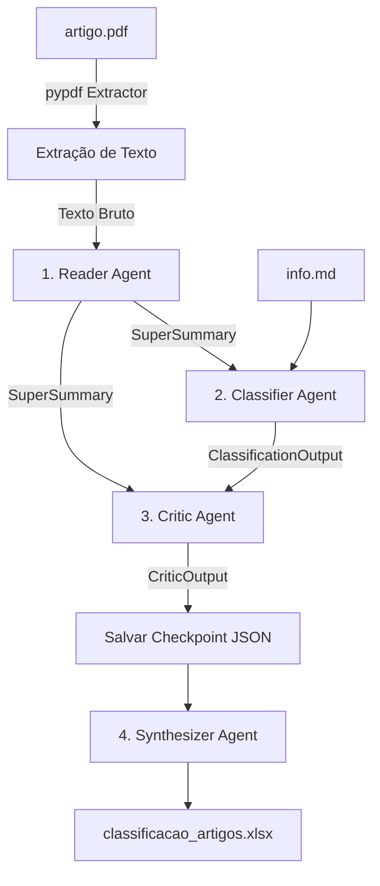

# 📊 Pipeline ADK — Classificação e Avaliação Automática de Artigos

Este repositório contém uma implementação completa de um **Pipeline Multiagente baseado na arquitetura ADK (Agent Development Kit)**. Ele foi desenvolvido especificamente para automatizar a leitura, estruturação, classificação temática, avaliação crítica e síntese de artigos acadêmicos entregues por alunos em disciplinas de Engenharia de Software.

O sistema processa múltiplos arquivos PDF, cruza as informações com o plano de ensino da disciplina, realiza uma avaliação crítica rigorosa com notas inteiras e justificativas textuais, calcula um indicador de qualidade sintético (**IFRD**) e consolida tudo em um relatório final estilizado no Excel (`classificacao_artigos.xlsx`).

---

## 🛠️ Arquitetura Multiagente (ADK)

O pipeline segue um fluxo de trabalho sequencial em que **agentes de IA especializados** se comunicam através da passagem de objetos de dados validados. Em vez de uma única chamada de contexto amplo, o trabalho é subdividido em etapas específicas para otimizar a precisão da IA e mitigar erros:



### 1. 📖 Reader Agent (Leitor e Destilador)
* **Entrada**: Texto bruto do artigo extraído do PDF (suporta até 1.000.000 de caracteres).
* **Saída**: Objeto estruturado do tipo `SuperSummary`.
* **Papel**: Funciona como um compilador de contexto. Ele condensa as 20 ou 30 páginas do PDF em informações cirúrgicas necessárias para os próximos agentes, reduzindo drasticamente o consumo de tokens e a distração de contexto da LLM.

### 2. 🏷️ Classifier Agent (Classificador de Metadados)
* **Entrada**: O `SuperSummary` gerado pelo Reader + os metadados do arquivo `info.md`.
* **Saída**: Objeto estruturado do tipo `ClassificationOutput`.
* **Papel**: Classifica e mapeia o artigo cientificamente (tipo de estudo, natureza de pesquisa, técnicas estatísticas) e pedagógica (unidades e tópicos da ementa abordados).

### 3. ⚖️ Critic Agent (Avaliador e Crítico)
* **Entrada**: O `SuperSummary` + a classificação do Classifier + metadados do aluno.
* **Saída**: Objeto estruturado do tipo `CriticOutput`.
* **Papel**: Avalia o artigo em 7 critérios fundamentais, gerando notas de 1 a 5 com justificativas ricas, além de extrair as principais descobertas, limitações do estudo e links de replicação.

### 4. 🗃️ Synthesizer Agent (Sintetizador de Corpus)
* **Entrada**: Lista contendo os resumos e notas de todos os artigos analisados.
* **Saída**: Objeto estruturado do tipo `SynthesisOutput`.
* **Papel**: Analisa o conjunto de dados completo (todos os trabalhos analisados) e gera um panorama coletivo dos artigos entregues pela classe.

---

## 🔍 O Super Summary (Foco no Contexto e Eficiência)

O `SuperSummary` é um dos componentes fundamentais do pipeline. Ele atua como um **filtro inteligente de informações**.

### O Problema do Contexto Amplo
Os artigos acadêmicos em formato PDF contêm muitos elementos secundários que podem desviar o foco da IA na hora de classificar e criticar (rodapé, referências bibliográficas, diagramações complexas de tabelas, introduções longas). Enviar o PDF completo para 3 ou 4 agentes custaria muito caro e tornaria a classificação muito lenta e imprecisa.

### A Solução
O **Reader Agent** executa a leitura profunda uma única vez e gera o `SuperSummary`, que possui a seguinte estrutura formal regulada por código ([super_summary.py](file:///c:/workspace/trab-medicao-artigos/src/models/super_summary.py)):

* **`core_research_question` (Questão de Pesquisa)**: A principal pergunta ou problema que o artigo se propõe a responder.
* **`methodology_description` (Descrição da Metodologia)**: O desenho do estudo, ambiente, participantes e processo de coleta de dados.
* **`key_findings` (Principais Descobertas)**: Uma lista de 1 a 10 frases objetivas descrevendo as principais conclusões científicas do artigo.
* **`statistical_techniques` (Técnicas Estatísticas)**: Uma lista explícita com todos os métodos estatísticos usados no artigo (ex: Teste T, Regressão, ANOVA, estatística descritiva).

Esta estrutura compacta e rica serve de subsídio para todos os agentes seguintes.

---

## 📋 Classificação de Ementa e Plano de Ensino

O pipeline mapeia a aderência do artigo ao plano de ensino da disciplina, configurado no arquivo [config.py](file:///c:/workspace/trab-medicao-artigos/src/config.py):

* **Unidades Mapeadas**: `Unidade 1`, `Unidade 2` e `Unidade 3`.
* **Tópicos da Ementa (14 tópicos específicos)**:
  1. *Métricas de produto*
  2. *Métricas de processo*
  3. *Métricas de projeto*
  4. *Processos e técnicas de medição*
  5. *Identificação, organização e validação de métricas de software*
  6. *Distribuições de probabilidade*
  7. *Testes de hipótese*
  8. *Análise multivariada*
  9. *Estratégias de experimentação*
  10. *Processo de experimentação*
  11. *Planejamento de experimento*
  12. *Execução de experimento*
  13. *Análise de resultados de experimentos*
  14. *Apresentação de resultados experimentais*

A IA lê o conteúdo destilado do artigo e marca quais desses tópicos e unidades foram de fato contemplados.

---

## ⚖️ Rubricas de Avaliação Crítica

O **Critic Agent** analisa os resultados sob 7 critérios estruturados ([critic_output.py](file:///c:/workspace/trab-medicao-artigos/src/models/critic_output.py)). Cada nota dada é uma nota inteira de **1 a 5** e obrigatoriamente inclui uma justificativa textual detalhada (entre 20 e 500 caracteres):

| Critério | Definição no Pipeline |
| :--- | :--- |
| **Qualidade Acadêmica** | Rigor metodológico, clareza na redação, confiabilidade das fontes e validade geral das conclusões do estudo. |
| **Replicabilidade** | Disponibilidade e detalhamento de protocolos, código-fonte, dados brutos e etapas para que o estudo seja repetido por terceiros. |
| **Aplicabilidade Prática** | A utilidade real das descobertas ou métodos descritos no artigo para resolver problemas reais no mercado e na indústria de engenharia de software. |
| **Contribuição Teórica** | O quanto o artigo avança na ciência de software criando novos modelos, taxonomias, teorias ou conceitos formais. |
| **Adequação ao Aluno** | Grau de compatibilidade e complexidade do artigo com o nível acadêmico de estudantes do 6º período de Engenharia de Software. |
| **Contribuição para Aprendizagem** | Valor do artigo como material de estudo didático focado nos tópicos práticos de medição e experimentação. |
| **Alinhamento ao Plano** | Grau de aderência aos objetivos globais das aulas e temas das unidades da disciplina de Medição. |

Adicionalmente, o crítico identifica:
* **Disponibilidade de Dados**: Classificado entre *Totalmente Disponível*, *Parcialmente Disponível* ou *Não Disponível*.
* **Artefatos Compartilhados**: Lista de arquivos extras identificados (*Código Fonte*, *Dataset*, *Scripts R/Python*, *Questionários* ou *Nenhum*).
* **Resumo em Português**: Resumo do artigo traduzido e adaptado de até 150 palavras.
* **3 Descobertas e 1 Limitação Principal**.

---

## 📊 O Índice IFRD (Índice de Aderência e Qualidade)

Para dar um diagnóstico sintético e rápido de cada trabalho, o pipeline calcula o **IFRD** a partir de uma média ponderada das notas atribuídas pelo **Critic Agent**:

$$IFRD = (Qualidade \times 0.25) + (Alinhamento \times 0.20) + (Aprendizagem \times 0.20) + (Replicabilidade \times 0.15) + (Aplicabilidade \times 0.10) + (Adequacao \times 0.10)$$

### Categorias do IFRD:
* 🔴 **< 2.50**: Artigo Insuficiente
* 🟡 **2.50 - 3.49**: Artigo Regular
* 🟢 **3.50 - 4.49**: Bom Artigo
* ⭐ **>= 4.50**: Excelente Artigo

---

## 🔑 Configuração e Execução Técnica

### Integração OpenAI + Instructor
O pipeline se conecta ao gateway **OpenRouter** enviando requisições estruturadas para o modelo **`deepseek-v4-flash`** (a versão mais econômica e rápida, com janela de contexto de 1.000.000 de tokens). O uso do pacote `instructor` garante que o modelo responda estritamente respeitando os modelos de dados definidos em Pydantic.

### 1. Requisitos de Ambiente
* Python 3.10+
* Conexão ativa com a internet
* Conta no [OpenRouter](https://openrouter.ai/) e saldo para chamadas de API (o custo para processar os ~86 artigos é inferior a **$0.90 USD**).

### 2. Passo a Passo para Execução (Terminal Windows PowerShell)

1. **Ative o ambiente virtual e instale dependências**:
   ```powershell
   .venv\Scripts\Activate.ps1
   pip install -r requirements.txt
   ```

2. **Crie a chave de API no arquivo `.env` na raiz**:
   Crie um arquivo chamado `.env` e coloque a sua chave do OpenRouter:
   ```env
   OPENROUTER_API_KEY=sk-or-v1-sua_chave_real_aqui
   ```

3. **Estrutura esperada de arquivos**:
   ```text
   artigos/
     └── [Nome da Turma]/
         └── [Nome do Aluno]/
             ├── info.md      # Arquivo Markdown com título e metadados do aluno
             └── artigo.pdf   # O PDF real do artigo (renomeado exatamente para artigo.pdf)
   ```

4. **Rodar o Pipeline**:
   * **Execução em lote (Completa - Recomendada)**:
     Processa todos os artigos. O parâmetro `--resume` garante que se a execução for interrompida, ela continue exatamente do último artigo processado, carregando os checkpoints anteriores do disco sem gastar novos tokens na API:
     ```powershell
     python run_adk_pipeline.py --resume
     ```
   
   * **Testar um único artigo (Dry-Run)**:
     Testa o pipeline completo no primeiro artigo encontrado:
     ```powershell
     python run_adk_pipeline.py --dry-run
     ```

   * **Filtrar por aluno ou palavra-chave**:
     Processa apenas pastas ou arquivos que correspondam à busca:
     ```powershell
     python run_adk_pipeline.py --article-id "Amanda Bicalho"
     ```

---

## 💾 Resiliência e Checkpoints (`.adk_checkpoints/`)

O script grava no disco rígido (dentro de `.adk_checkpoints/`) o resultado completo de cada artigo processado com sucesso em arquivos `.json` individuais. 

Caso o script falhe ou você queira parar a execução pressionando `Ctrl + C`:
1. Os dados dos artigos já processados estão salvos de forma permanente.
2. A tabela do Excel `classificacao_artigos.xlsx` não é afetada ou danificada.
3. Ao reexecutar o comando com `--resume`, o pipeline lê os checkpoints salvos localmente e retoma os que faltam imediatamente.
4. Quando todos os artigos finalizarem, a planilha Excel será criada contendo a consolidação de todos os dados e estilização visual das colunas.